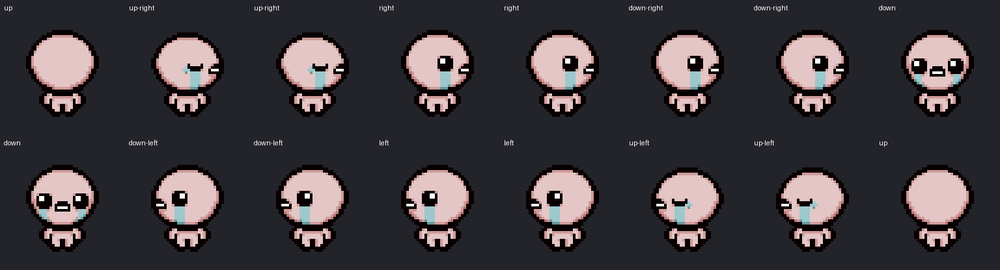

# Isaac Pet

一个面向桌面平台的非官方 Isaac 桌宠项目，使用项目中提供的《The Binding of Isaac: Rebirth》Isaac 像素素材制作。

当前版本是原生 macOS 应用；仓库使用与平台无关的名称，后续可在同一项目中扩展 Windows 版本。



## 功能

- 透明无边框窗口，始终置顶并可出现在所有桌面空间
- Isaac 会在当前屏幕底部自主走动，并朝鼠标方向观察
- 单击招手、双击跳跃、拖拽移动、右键打开菜单
- 可从菜单栏或右键菜单进入游玩模式，使用 WASD 移动、方向键发射泪弹
- 菜单可触发哭泣、点赞和观察动画，调整大小或暂停走动
- 记忆大小、走动开关、屏幕和横向位置
- 可选登录时启动，不显示 Dock 图标，菜单栏保留 Isaac 入口
- 本地独立运行，不联网、不收集数据

## 平台状态

- macOS 13+：已实现，使用 Swift 6 和 AppKit
- Windows：规划中，当前仓库尚不提供 Windows 可执行文件

## 系统要求

- macOS 13 或更高版本
- Apple Silicon 或 Intel Mac
- 从源码构建需要 Swift 6 和 macOS Command Line Tools

## 构建

```bash
scripts/build_app.sh
```

生成结果：

```text
dist/Isaac Pet.app
```

应用使用 ad-hoc 本地签名，可以直接在本机运行。若要重新生成 Isaac 图集和图标，需要安装 Pillow，并设置 `ISAAC_REGENERATE_ASSETS=1`：

```bash
ISAAC_REGENERATE_ASSETS=1 scripts/build_app.sh
```

## 安装

```bash
scripts/install_app.sh
```

默认安装到 `~/Applications/Isaac Pet.app` 并打开。也可以直接双击 `dist/Isaac Pet.app`。

## 操作

- 单击 Isaac：招手
- 双击 Isaac：跳跃
- 拖拽 Isaac：移动到另一个位置或屏幕，松手后停在该屏幕底部
- 右键 Isaac：打开动作与设置菜单
- 菜单栏 Isaac 图标：随时打开同一个菜单
- 游玩模式：WASD 连续移动，方向键可按住连发泪弹，Esc 退出并恢复桌宠行为
- 游玩模式行走：A/D 使用左右步态；W 使用后脑勺和背面身体步态，S 使用正脸和正面身体步态
- 发射瞬间：左右/向下会短暂闭眼，向上会显示轻微压扁的后脑勺姿态

透明像素会穿透到下方应用，只有 Isaac 的可见身体响应鼠标。

## 验证

```bash
scripts/verify_app.sh
```

该命令验证应用包结构、签名、图集尺寸、独立性以及动画、方向、状态优先级和屏幕几何逻辑。当前纯命令行工具链不包含 XCTest，因此核心检查使用零依赖的 Swift 可执行测试程序 `IsaacPetCoreChecks`。

## 项目结构

- `Sources/IsaacPetCore`：可复用的动画表、方向映射、状态和屏幕几何
- `Sources/IsaacPetApp`：当前 macOS 版的 AppKit 窗口、渲染、交互、菜单与登录启动
- `Assets/Source`：平台共享的 Isaac 原始像素素材
- `Resources`：应用图集、图标和 Info.plist
- `scripts`：素材生成、构建、安装和验证脚本

未来增加 Windows 版本时，应保留现有 macOS 应用和共享素材，在独立的平台目录中添加 Windows UI、窗口管理及安装打包实现。

## 声明

这是非官方、非商业同人项目。Isaac、《The Binding of Isaac》及原始美术素材的权利归各自权利方所有。重新分发或商业使用前，请阅读 [NOTICE.md](NOTICE.md) 并自行确认所需授权。
