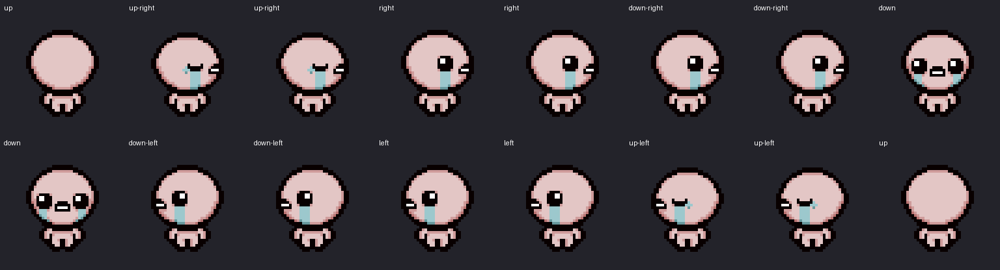

# Isaac Pet

一个面向桌面平台的非官方 Isaac 桌宠项目，使用项目中提供的《The Binding of Isaac: Rebirth》Isaac 像素素材制作。

当前版本是原生 macOS 应用；仓库使用与平台无关的名称，后续可在同一项目中扩展 Windows 版本。



## 功能

- 透明无边框窗口，始终置顶并可出现在所有桌面空间
- Isaac 会在当前屏幕底部自主走动，并朝鼠标方向观察
- 单击招手、双击跳跃、拖拽移动、右键打开菜单
- 可从菜单栏或右键菜单进入游玩模式，使用 WASD 移动、方向键发射泪弹
- 菜单可触发哭泣、点赞和观察动画，调整大小或暂停走动
- 抽张塔罗牌：Isaac 双手举卡，卡牌在头顶绕竖轴旋转两秒后向你放大展示，复原后浮出卡名与祝福语，含正位与逆位共 44 张大阿尔克那牌
- 像素风对话气泡，可随机说话、显示颜文字或输入自定义文字
- 可选 OpenAI Responses API 对话：默认关闭，API Key 只存 macOS 钥匙串
- 内置本地 Todo 窗口，可新增、完成、恢复和删除任务，并设置定时提醒
- 到期任务会通过 Isaac 气泡提醒；授权后也会发送 macOS 系统通知
- 可手动从 Apple“提醒事项”导入指定列表，并按系统条目 ID 去重更新
- 可手动从 Notion data source 导入任务，访问令牌只保存在 macOS 钥匙串
- 内置专注计时：15/25/45 分钟本机倒计时，支持目标、取消、完成弹窗与系统通知，重启后自动恢复
- 角色皮肤只改变外观与对话人格：切换形象后，“问桌宠（LLM）”会使用对应角色的系统提示词
- 记忆大小、走动开关、屏幕和横向位置
- 可选登录时启动，不显示 Dock 图标，菜单栏保留 Isaac 入口
- 默认本地独立运行；只有手动同步 Notion 或主动使用 LLM 时才访问对应服务，不收集遥测

## 平台状态

- macOS 13+：已实现，使用 Swift 6 和 AppKit
- Windows 10/11：初步移植（.NET 8 + WPF），见 [Windows/README.md](Windows/README.md)。核心桌宠、游玩模式、Todo、LLM 对话已可用；Notion 同步与专注计时尚未移植

## 系统要求

- macOS 13 或更高版本
- Apple Silicon 或 Intel Mac
- 从源码构建需要 Swift 6 和 macOS Command Line Tools

## 构建

```bash
scripts/build_app.sh
```

生成结果：

```text
dist/Isaac Pet.app
```

应用使用 ad-hoc 本地签名，可以直接在本机运行。若要重新生成 Isaac 图集和图标，需要安装 Pillow，并设置 `ISAAC_REGENERATE_ASSETS=1`：

```bash
ISAAC_REGENERATE_ASSETS=1 scripts/build_app.sh
```

## 安装

```bash
scripts/install_app.sh
```

默认安装到 `~/Applications/Isaac Pet.app` 并打开。也可以直接双击 `dist/Isaac Pet.app`。

## 操作

- 单击 Isaac：招手
- 双击 Isaac：跳跃
- 拖拽 Isaac：移动到另一个位置或屏幕，松手后停在该屏幕底部
- 右键 Isaac：打开动作与设置菜单
- 对话气泡：从右键或菜单栏菜单选择随机文字、颜文字或“自定义气泡…”
- 抽塔罗牌：从菜单选择“抽张塔罗牌”，Isaac 会双手举起，卡牌在头顶绕竖轴旋转约两秒（背面为游戏内的牌背图案），随后向屏幕外放大展示结果并复原，浮出卡名与祝福语；约四分之一概率抽到逆位卡牌。卡面与文本取自以撒中文维基，完全离线展示
- LLM：先从“LLM 设置…”填写 Base URL、API Key、模型并保存，再用“问 {当前形象}（LLM）…”主动发送单条问题
- Todo：从菜单进入“新建 Todo…”、“查看 Todo…”或“查看今日计划…”。今日计划只读本机 Todo，按逾期、今天到期、后续到期、无日期的顺序给出最多三项重点，也可以让 Isaac 显示下一项
- Apple 提醒事项：从 Todo 子菜单选择“从 Apple 提醒事项同步…”，授权后选择一个列表或全部列表
- Notion：从 Todo 子菜单进入“Notion 设置…”，保存 internal integration token 与 data source ID 后手动同步
- 专注计时：从“专注计时”子菜单选择“开始专注计时…”，填写可选目标与时长；运行中可在同一子菜单查看剩余时间并取消
- 桌宠形象：从“桌宠形象”子菜单切换已安装角色图集；形象同时决定 LLM 对话的人格提示词，不会改变任何功能权限
- 菜单栏 Isaac 图标：随时打开同一个菜单
- 游玩模式：WASD 连续移动，方向键可按住连发泪弹，Esc 退出并恢复桌宠行为
- 游玩模式行走：A/D 使用左右步态；W 使用后脑勺和背面身体步态，S 使用正脸和正面身体步态
- 发射瞬间：左右/向下会短暂闭眼，向上会显示轻微压扁的后脑勺姿态

透明像素会穿透到下方应用，只有 Isaac 的可见身体响应鼠标。

Todo 数据仅保存在本机：

```text
~/Library/Application Support/Isaac Pet/todos-v1.json
```

设置了提醒时间后，应用会在首次需要时请求 macOS 通知权限。拒绝权限不会影响 Todo 和 Isaac 运行期间的气泡提醒。

Apple“提醒事项”同步是用户主动触发的只读导入：

- 首次同步时 macOS 会请求“提醒事项”读取权限。
- Isaac Pet 不会创建、修改或删除 Apple“提醒事项”中的内容。
- 再次同步会通过系统条目 ID 更新已导入 Todo，不会按标题猜测合并。
- 系统中尚未导入的已完成历史不会批量进入本地 Todo；已链接任务的完成状态会正常刷新。
- Apple“提醒事项”是已链接任务的读取源；若只在 Isaac 本地修改标题、时间或完成状态，下次同步会以系统内容为准。

Notion 同步同样采用手动只读模式：

1. 在 Notion 创建 internal integration，并只授予读取内容所需能力。
2. 把目标 data source 共享给该 integration。
3. 在 Isaac Pet 的“Notion 设置…”中填写 integration token 和 data source ID。
4. Token 只保存在 macOS 钥匙串；data source ID 保存在普通本机设置中。同步时它们只发送到 `api.notion.com`。
5. Isaac 会自动识别 title、date，以及常见的 Done/Complete/完成 checkbox 或 status。已链接条目以下次 Notion 同步结果为准。

“断开 Notion”会删除钥匙串中的 Token 和连接设置，不会删除已经导入的本地 Todo。当前使用 Notion API `2026-03-11`，单次手动同步上限为 1000 条。

## 可选 LLM 对话

LLM 默认关闭，不影响本地气泡、Todo 或专注计时：

- “LLM 设置…”中填写 Base URL、API Key 和模型 ID，并选择 API 格式：OpenAI 兼容（发往 `{Base URL}/chat/completions`）或 Anthropic 兼容（发往 `{Base URL}/v1/messages`）。兼容任意自建或第三方服务，本地服务可以把 API Key 留空。
- 连接配置保存在本机文件（权限 600），不使用 macOS 钥匙串，读取时不会出现系统授权弹窗：

  ```text
  ~/Library/Application Support/IsaacPet/llm-config.json
  ```

- 弹窗里的“导入配置文件…”可以导入上面格式的 JSON；`apiFormat` 支持 `openai` / `anthropic`，缺省时按 Base URL 推断。测试时可用环境变量 `ISAAC_LLM_CONFIG_PATH` 重定向该文件。
- 只有点击“问 {当前形象}（LLM）…”并确认发送时，当前输入才会发往所配置的服务；请求不会附带 Todo、Notion 内容、文件、桌面数据或历史对话，也不开放任何模型工具。
- 30 秒超时，可从菜单取消；回答经过 80 字气泡长度限制。
- “断开 LLM”会删除配置文件，本地功能继续可用。旧版本保存在钥匙串里的 OpenAI API Key 不再被读取，如需清理可在“钥匙串访问”中搜索 `com.fanmade.isaacpet.openai` 删除。

## 专注计时与人格

专注计时完全在本机运行：从“专注计时”子菜单开始一个 15/25/45 分钟倒计时，可填写可选目标；运行中菜单会显示剩余时间，可随时取消；结束时弹窗提醒，并在授权后发送系统通知。倒计时状态保存在本机设置中，应用重启后会自动恢复未结束的时段。

LLM 对话的人格提示词跟随当前桌宠形象：Isaac 天真爱哭，Magdalene 温柔体贴，Judas 机灵利落。人格只影响说话的语气，所有皮肤共享同样的能力边界——不能操作电脑、不调用工具、回答限 80 字，且只有用户主动提问时才联网。

## 多角色图集

角色外观是纯视觉层：切换皮肤不会获得或失去任何读取、写入、联网或命令权限，只会改变对话人格。Isaac 是内置默认图集；其他角色需要单独通过图集 QA 后放入对应资源位置：

```text
Resources/Agents/magdalene-spritesheet.webp
Resources/Agents/judas-spritesheet.webp
```

每个图集必须是 `1536×2288` 的 8×11 WebP，兼容现有的 192×208 单元格、九组动画和 16 个视线方向。资源不存在时菜单项保持禁用，应用安全回退为 Isaac，不会把单帧或未验证图像误作完整角色皮肤。

Magdalene 已具备完整桌宠图集：`Resources/Agents/magdalene-spritesheet.webp`。它以已审核的 Isaac 完整动作图集为身体、动作时序和注册位置基础，并将用户提供的 Golden Locks 原始像素按每个占用格的头部位置确定性叠加；不使用 AI 生成、重绘或插值。可用以下命令重建，并在 `qa/` 中检查接触表、方向表和校验报告：

```bash
MAG_PYTHON="/Users/zeppeli/.cache/codex-runtimes/codex-primary-runtime/dependencies/python/bin/python3"
"$MAG_PYTHON" scripts/derive_magdalene_atlas.py
"$MAG_PYTHON" /Users/zeppeli/.codex/skills/hatch-pet/scripts/validate_atlas.py \
  Resources/Agents/magdalene-spritesheet.webp --require-v2
```

原始角色图和 Golden Locks 条保存在 `Assets/Source/agents/`，不会被打进应用包。用户从菜单选择的外观会持久保存，同时决定对话人格；Magdalene 另有自己的射击、竖向行走和举卡辅助图集（`Resources/Agents/magdalene-shooting-atlas.webp`、`magdalene-walking-vertical-atlas.webp`、`magdalene-raising-atlas.webp`），由对应脚本派生；角色没有提供辅助图集时（如 Judas）仍安全回退 Isaac 的基础辅助图集。泪弹是共用的圆形道具。

塔罗牌内容与图标来自[以撒的结合中文维基](https://isaac.huijiwiki.com/wiki/卡牌)：44 张卡牌图标取自 wiki 的 `Cards_sprite.png`（即游戏内 HUD 卡面），名称、拾取语与使用效果整理自各卡牌页面，已静态收录为 `Sources/IsaacPetCore/TarotDeck.swift`。抽卡动画为双手举卡（点赞行手臂镜像派生，`scripts/derive_raising_atlas.py`），卡牌在头顶绕竖轴旋转、放大展示后复原（`CardRevealController` 时间线驱动）；牌背图案按 wiki 的斜画牌背重排为正立 14×18（`scripts/generate_card_back.py`）。QA 接触表见 `qa/raising-atlas-contact-sheet.png`、`qa/tarot-icons-contact-sheet.png`、`qa/card-back-contact-sheet.png`。

需要从终端或自动化工具直接打开界面时，可传入 `--show-todos`、`--show-daily-plan`、`--show-notion-settings` 或 `--show-llm-settings`。测试专注计时时可用环境变量 `ISAAC_FOCUS_DURATION_SECONDS` 提供额外时长选项。

## 验证

```bash
scripts/verify_app.sh
```

该命令验证应用包结构、签名、图集尺寸、独立性以及动画、方向、状态优先级和屏幕几何逻辑。当前纯命令行工具链不包含 XCTest，因此核心检查使用零依赖的 Swift 可执行测试程序 `IsaacPetCoreChecks`。

## 项目结构

- `Sources/IsaacPetCore`：可复用的动画表、方向映射、状态和屏幕几何
- `Sources/IsaacPetApp`：当前 macOS 版的 AppKit 窗口、渲染、交互、菜单与登录启动
- `Assets/Source`：平台共享的 Isaac 原始像素素材
- `Resources`：应用图集、图标和 Info.plist
- `scripts`：素材生成、构建、安装和验证脚本

未来增加 Windows 版本时，应保留现有 macOS 应用和共享素材，在独立的平台目录中添加 Windows UI、窗口管理及安装打包实现。（已落地：`Windows/` 目录即 Windows 移植。）

## 声明

这是非官方、非商业同人项目。Isaac、《The Binding of Isaac》及原始美术素材的权利归各自权利方所有。重新分发或商业使用前，请阅读 [NOTICE.md](NOTICE.md) 并自行确认所需授权。
